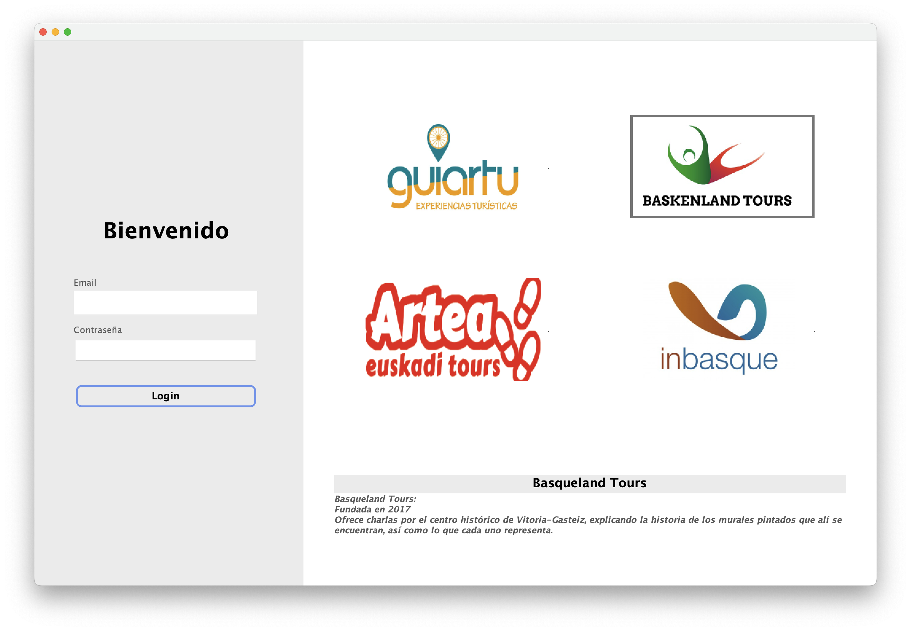
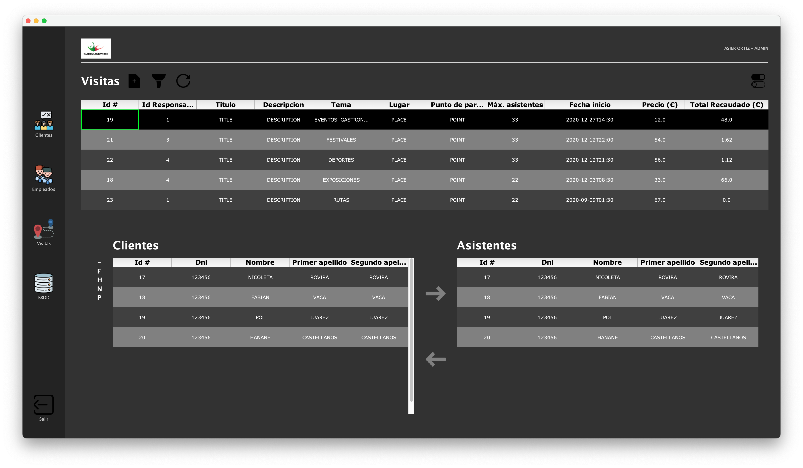

# Agencias Turísticas

Academic project developed in Java for managing travel agencies. Utilizes four different databases (Oracle, MySQL, SQLite, and DB4Objects) along with Hibernate ORM for data handling

## Screenshots

